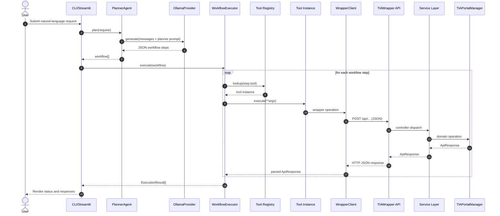

# OT Engineering Repository Architecture

## Scope
This repository contains two coupled applications:

- `tia-agent` (Python): AI planner and workflow executor (CLI + Streamlit UI).
- `TIAWrapper` (.NET 8 Web API): Adapter service for Siemens TIA Portal operations.

The Python app plans high-level automation steps with an LLM and executes each step through tool adapters that call the C# wrapper API.

## High-Level Architecture

```mermaid
flowchart LR
    U[User]

    subgraph PY[tia-agent (Python)]
        CLI[app.py CLI]
        ST[streamlit_app.py UI]
        PA[PlannerAgent]
        BA[BaseAgent]
        PF[ProviderFactory]
        OP[OllamaProvider]
        AP[AzureProvider placeholder]
        EX[WorkflowExecutor]
        REG[Tool Registry]
        TOOLS[Tool classes\nconnect/create_project/open_project/save_project/create_plc/create_hmi]
        WC[WrapperClient]
        RH[ResponseHandler]
        LOG[Logger]
    end

    subgraph LLM[LLM]
        OLLAMA[Ollama Server]
        AZURE[Azure OpenAI not implemented]
    end

    subgraph NET[TIAWrapper (.NET 8 Web API)]
        CTL[Controllers\nConnection/Project/PLC/HMI]
        SVC[Services\nIConnection/IProject/IPLC/IHMI]
        MGR[TIAPortalManager]
        TIA[Siemens TIA Openness\ncurrently stubbed TODO]
    end

    U --> CLI
    U --> ST

    CLI --> PA
    ST --> PA

    PA --> BA --> PF
    PF --> OP --> OLLAMA
    PF -.selects.-> AP
    AP --> AZURE

    PA --> EX
    EX --> REG --> TOOLS --> WC
    WC -->|HTTP POST JSON| CTL
    CTL --> SVC --> MGR --> TIA

    WC --> RH
    RH --> EX
    EX --> LOG
```

## Runtime Flow

1. User sends a request in `app.py` or `streamlit_app.py`.
2. `PlannerAgent` loads `prompts/planner.txt` and asks the active LLM provider.
3. LLM returns a JSON workflow (list of steps).
4. `WorkflowExecutor` resolves each step via `tools/registry.py`.
5. Concrete tool calls `WrapperClient`, which invokes `TIAWrapper` endpoints.
6. `ResponseHandler` parses API response into `ApiResponse`; failures raise `WrapperException`.
7. Executor returns `ExecutionResult` list for UI/CLI rendering and logs to `logs/execution.log`.

## Runtime Sequence Diagram



## API Boundary

Python `WrapperClient` expects these endpoint paths under configured base URL (`WRAPPER_URL`):

- `/connection/connect`
- `/connection/disconnect`
- `/project/create`
- `/project/open`
- `/project/save`
- `/plc/create`
- `/hmi/create`

.NET controllers are routed as:

- `/api/connection/*`
- `/api/project/*`
- `/api/plc/*`
- `/api/hmi/*`

This means `WRAPPER_URL` should include `/api` suffix (for example, `http://localhost:5000/api`) to match current Python client paths.

## Notable Design Observations

- `AzureProvider.generate` is intentionally not implemented yet.
- `prompts/planner.txt` mentions `close_project`, but there is no corresponding Python tool in `tools/registry.py`.
- `TIAWrapper/Managers/TIAPortalManager.cs` is currently a functional stub with TODO blocks for Siemens Openness DLL integration.
- `tia-agent/requirements.txt` does not list `streamlit` or `requests`, though both are used in the code.

## Key Source Map

Python orchestration:

- `tia-agent/streamlit_app.py`
- `tia-agent/app.py`
- `tia-agent/agents/planner_agent.py`
- `tia-agent/workflow/executor.py`
- `tia-agent/tools/registry.py`
- `tia-agent/services/wrapper_client.py`

.NET backend:

- `TIAWrapper/Program.cs`
- `TIAWrapper/Controllers/*.cs`
- `TIAWrapper/Services/*.cs`
- `TIAWrapper/Managers/TIAPortalManager.cs`
